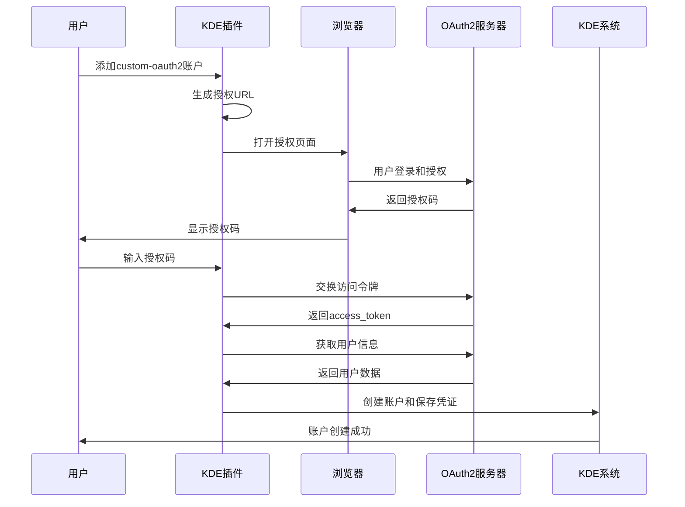

# KDE OAuth2 Plugin

这是一个为 KDE Online Accounts 系统开发的自定义 OAuth2 认证插件，用于连接到您的自定义 OAuth2 服务器。

## 🚀 快速开始

### Git 仓库设置
```bash
# 克隆仓库
git clone <repository-url>
cd kde-oauth2-plugin

# 安装构建依赖
sudo apt install build-essential cmake qtbase5-dev libkaccounts-dev libkf5i18n-dev

# 构建项目
./quick_build.sh

# 安装插件
sudo make install
```

## 功能特性

- ✅ 完整的 OAuth2 授权码流程支持
- ✅ 集成 KDE Online Accounts 系统
- ✅ 自定义 OAuth2 服务器配置
- ✅ 用户友好的认证对话框
- ✅ 账户管理和配置功能
- ✅ 自动令牌获取和刷新
- ✅ 安全的凭证存储

## 服务器配置

插件配置连接到以下 OAuth2 服务器：

- **服务器地址**: http://192.168.1.12:9007
- **客户端ID**: 10001
- **授权端点**: /connect/authorize
- **令牌端点**: /connect/token
- **用户信息端点**: /connect/userinfo
- **回调地址**: http://localhost:8080/callback
- **作用域**: read write

## Access Token 获取和使用

### 🔑 Access Token 存储位置

OAuth2认证成功后，access_token和相关凭证会自动保存在KDE账户系统中：

**数据库位置**: `~/.config/libaccounts-glib/accounts.db`

### 📋 查询方法

#### 方法1: 使用 ag-tool 命令行工具

```bash
# 列出所有账户
ag-tool list-accounts

# 查看特定账户的所有设置 (假设账户ID为7)
ag-tool list-settings 7

# 获取 access_token
ag-tool get-account 7 string:access_token

# 获取 refresh_token
ag-tool get-account 7 string:refresh_token

# 获取服务器地址
ag-tool get-account 7 string:server

# 获取用户名
ag-tool get-account 7 string:username
```

#### 方法2: 直接查询 SQLite 数据库

```bash
# 安装 sqlite3 (如果尚未安装)
sudo apt install sqlite3

# 查看所有 custom-oauth2 账户
sqlite3 ~/.config/libaccounts-glib/accounts.db "SELECT * FROM Accounts WHERE provider='custom-oauth2';"

# 获取指定账户的 access_token (账户ID替换为实际值)
sqlite3 ~/.config/libaccounts-glib/accounts.db "SELECT value FROM Settings WHERE account=7 AND key='access_token';"

# 获取账户的所有凭证
sqlite3 ~/.config/libaccounts-glib/accounts.db "SELECT key, value FROM Settings WHERE account=7;"
```

#### 方法3: 在 C++/Qt 程序中使用

```cpp
#include <Accounts/Manager>
#include <Accounts/Account>

// 获取账户管理器
Accounts::Manager *manager = new Accounts::Manager();

// 查找 custom-oauth2 提供者的账户
Accounts::AccountIdList accountIds = manager->accountList("custom-oauth2");

for (Accounts::AccountId id : accountIds) {
    Accounts::Account *account = manager->account(id);
    if (account && account->enabled()) {
        // 获取 access_token
        QString accessToken = account->value("access_token").toString();
        
        // 获取其他信息
        QString server = account->value("server").toString();
        QString username = account->value("username").toString();
        
        qDebug() << "Access Token:" << accessToken;
        qDebug() << "Server:" << server;
        qDebug() << "Username:" << username;
    }
}
```

#### 方法4: 在 Python 程序中使用

```python
import sqlite3
import os

def get_oauth2_credentials(account_id=None):
    """获取OAuth2凭证"""
    db_path = os.path.expanduser("~/.config/libaccounts-glib/accounts.db")
    
    if not os.path.exists(db_path):
        return None
    
    conn = sqlite3.connect(db_path)
    cursor = conn.cursor()
    
    # 如果没有指定账户ID，查找第一个custom-oauth2账户
    if account_id is None:
        cursor.execute("SELECT id FROM Accounts WHERE provider='custom-oauth2' AND enabled=1 LIMIT 1")
        result = cursor.fetchone()
        if not result:
            return None
        account_id = result[0]
    
    # 获取所有凭证
    cursor.execute("SELECT key, value FROM Settings WHERE account=?", (account_id,))
    settings = dict(cursor.fetchall())
    
    conn.close()
    
    # 清理引号
    for key, value in settings.items():
        if isinstance(value, str) and value.startswith("'") and value.endswith("'"):
            settings[key] = value[1:-1]
    
    return settings

# 使用示例
credentials = get_oauth2_credentials()
if credentials:
    access_token = credentials.get('access_token')
    server = credentials.get('server')
    print(f"Access Token: {access_token}")
    print(f"Server: {server}")
```

### 🔄 Token 刷新

当access_token过期时，可以使用refresh_token获取新的访问令牌：

```bash
# 获取refresh_token
REFRESH_TOKEN=$(ag-tool get-account 7 string:refresh_token)

# 使用refresh_token获取新的access_token
curl -X POST http://192.168.1.12:9007/connect/token \
  -H "Content-Type: application/x-www-form-urlencoded" \
  -d "grant_type=refresh_token&refresh_token=$REFRESH_TOKEN&client_id=10001"
```

### 📝 当前账户信息示例

基于最新的认证，当前存储的信息包括：

- **账户ID**: 7
- **用户名**: OAuth2 User  
- **服务器**: http://192.168.1.12:9007
- **客户端ID**: 10001
- **Access Token**: JWT格式的访问令牌
- **Refresh Token**: 用于刷新访问令牌
- **凭证ID**: 14

### ⚠️ 安全注意事项

1. **访问权限**: 数据库文件仅对当前用户可读
2. **Token保护**: 请勿在日志中记录完整的access_token
3. **传输安全**: 建议在生产环境中使用HTTPS
4. **定期刷新**: 监控token过期并及时刷新

## 编译要求

- CMake 3.10+
- Qt5 Core, Network, Widgets, Gui
- KDE Frameworks 5 (KF5I18n)
- libkaccounts (KAccounts framework)

## 编译和安装

```bash
# 创建构建目录
mkdir build && cd build

# 配置项目
cmake ..

# 编译
make

# 安装 (需要root权限)
sudo make install
```

## 文件结构

```
kde-oauth2-plugin/
├── src/
│   ├── kdeoauth2plugin.h      # 插件头文件
│   ├── kdeoauth2plugin.cpp    # 插件实现
│   └── kdeoauth2plugin.json   # 插件元数据
├── custom-oauth2.provider     # OAuth2提供者配置
├── custom-oauth2.service      # OAuth2服务配置
├── CMakeLists.txt            # 构建配置
└── readme.md                 # 项目文档
```

## 安装位置

- **插件文件**: `/usr/lib/x86_64-linux-gnu/qt5/plugins/kaccounts/ui/kde_oauth2_plugin.so`
- **插件元数据**: `/usr/lib/x86_64-linux-gnu/qt5/plugins/kaccounts/ui/kde_oauth2_plugin.so.json`
- **提供者配置**: `/usr/share/accounts/providers/custom-oauth2.provider`
- **服务配置**: `/usr/share/accounts/services/custom-oauth2.service`

## 使用方法

### 在 KDE 系统设置中添加账户

1. 确保您的 OAuth2 服务器在 `http://192.168.1.12:9007` 上运行
2. 打开 KDE 系统设置
3. 导航到 "在线账户" 部分
4. 选择 "custom-oauth2 账户"
5. 按照对话框提示完成 OAuth2 认证流程：
   - 点击 "在浏览器中打开认证页面"
   - 在浏览器中完成登录和授权
   - 复制回调页面显示的授权码
   - 在对话框中输入授权码
   - 点击确定完成认证

### 在其他程序中使用 Access Token

#### 快速获取脚本

我们提供了两个便捷的工具来获取存储的OAuth2凭证：

##### 1. Shell脚本工具 (`get_oauth_token.sh`)

```bash
# 基本使用
./get_oauth_token.sh

# 显示完整token
./get_oauth_token.sh --full

# 导出为环境变量
source <(./get_oauth_token.sh --export)
```

输出示例：
```
账户ID: 7
访问令牌: eyJhbGciOiJSUzI1NiIsImtpZCI6IjVmOTE1NGFhLWY4...
服务器: http://192.168.1.12:9007
用户名: OAuth2 User
刷新令牌: hrQHLH8DhO8Hr5FjpkcbS4cYusp3uN...

测试令牌有效性...
✅ 令牌有效
```

##### 2. Python工具 (`oauth2_credentials.py`)

```bash
# 基本使用
python3 oauth2_credentials.py

# 列出所有账户
python3 oauth2_credentials.py --list

# JSON格式输出
python3 oauth2_credentials.py --json

# 测试令牌有效性
python3 oauth2_credentials.py --test

# 指定特定账户
python3 oauth2_credentials.py --account=7
```

在Python代码中使用：
```python
from oauth2_credentials import OAuth2CredentialManager

manager = OAuth2CredentialManager()
credentials = manager.get_credentials()

if credentials:
    access_token = credentials['access_token']
    server = credentials['server']
    
    # 使用令牌调用API
    import requests
    
    headers = {'Authorization': f'Bearer {access_token}'}
    response = requests.get(f'{server}/connect/userinfo', headers=headers)
    print(response.json())
```

#### 在 Shell 脚本中使用

```bash
#!/bin/bash
# 使用OAuth2 API的示例脚本

# 获取访问令牌
ACCESS_TOKEN=$(sqlite3 ~/.config/libaccounts-glib/accounts.db "SELECT value FROM Settings WHERE account=7 AND key='access_token'" | sed "s/^'//;s/'$//")

if [ -z "$ACCESS_TOKEN" ]; then
    echo "错误: 无法获取访问令牌"
    exit 1
fi

# 调用API
curl -H "Authorization: Bearer $ACCESS_TOKEN" \
     -H "Content-Type: application/json" \
     http://192.168.1.12:9007/connect/userinfo

# 上传文件示例
curl -H "Authorization: Bearer $ACCESS_TOKEN" \
     -F "file=@example.txt" \
     http://192.168.1.12:9007/api/upload
```

#### 在 Node.js 中使用

```javascript
const sqlite3 = require('sqlite3').verbose();
const path = require('path');
const os = require('os');
const axios = require('axios');

async function getOAuth2Credentials() {
    return new Promise((resolve, reject) => {
        const dbPath = path.join(os.homedir(), '.config/libaccounts-glib/accounts.db');
        const db = new sqlite3.Database(dbPath);
        
        // 查找最新的custom-oauth2账户
        db.get(
            "SELECT id FROM Accounts WHERE provider='custom-oauth2' AND enabled=1 ORDER BY id DESC LIMIT 1",
            (err, row) => {
                if (err) {
                    reject(err);
                    return;
                }
                
                if (!row) {
                    reject(new Error('No custom-oauth2 account found'));
                    return;
                }
                
                const accountId = row.id;
                
                // 获取凭证
                db.all(
                    "SELECT key, value FROM Settings WHERE account=?",
                    [accountId],
                    (err, rows) => {
                        if (err) {
                            reject(err);
                            return;
                        }
                        
                        const credentials = {};
                        rows.forEach(row => {
                            let value = row.value;
                            // 移除SQLite字符串引号
                            if (typeof value === 'string' && value.startsWith("'") && value.endsWith("'")) {
                                value = value.slice(1, -1);
                            }
                            credentials[row.key] = value;
                        });
                        
                        db.close();
                        resolve(credentials);
                    }
                );
            }
        );
    });
}

// 使用示例
async function main() {
    try {
        const credentials = await getOAuth2Credentials();
        const accessToken = credentials.access_token;
        const server = credentials.server;
        
        console.log('Server:', server);
        console.log('Access Token:', accessToken.substring(0, 20) + '...');
        
        // 调用API
        const response = await axios.get(`${server}/connect/userinfo`, {
            headers: {
                'Authorization': `Bearer ${accessToken}`,
                'Content-Type': 'application/json'
            }
        });
        
        console.log('User Info:', response.data);
        
    } catch (error) {
        console.error('Error:', error.message);
    }
}

main();
```

## 🔧 配置管理

### Provider文件与插件参数绑定

**重要说明**: Provider文件和插件代码中的参数必须保持一致！

#### 当前架构问题
- ❌ **参数重复**: 相同的OAuth2配置在两个地方定义
- ❌ **维护困难**: 修改配置需要同时更新provider文件和代码
- ❌ **扩展性差**: 不支持多个不同的OAuth2服务器

#### 推荐解决方案

##### 1. 统一配置源
让provider文件成为唯一的配置源，插件代码从provider文件中读取配置：

```xml
<!-- gzweibo-oauth2.provider -->
<template>
    <group name="oauth2">
        <setting name="server_url">http://192.168.1.12:9007</setting>
        <setting name="client_id">10001</setting>
        <setting name="auth_path">/connect/authorize</setting>
        <!-- ... 其他配置 -->
    </group>
</template>
```

##### 2. 插件代码配置加载
```cpp
void KDEOAuth2Plugin::loadProviderConfiguration() {
    // 从KAccounts配置系统中读取provider参数
    // 替代当前的硬编码参数
}
```

##### 3. 环境变量覆盖（临时方案）
使用环境变量进行配置覆盖：

```bash
# 加载配置
source oauth2_config.env

# 构建时使用配置
./build_deb.sh
```

#### 配置参数对照表

| Provider文件 | 插件代码变量 | 环境变量 | 说明 |
|-------------|-------------|---------|-----|
| Host | m_serverUrl | OAUTH2_SERVER_URL | OAuth2服务器地址 |
| ClientId | m_clientId | OAUTH2_CLIENT_ID | 客户端ID |
| AuthPath | m_authPath | OAUTH2_AUTH_PATH | 授权端点路径 |
| TokenPath | m_tokenPath | OAUTH2_TOKEN_PATH | 令牌端点路径 |
| UserInfoPath | m_userInfoPath | OAUTH2_USERINFO_PATH | 用户信息端点路径 |
| RedirectUri | m_redirectUri | OAUTH2_REDIRECT_URI | 回调URI |
| Scope | m_scope | OAUTH2_SCOPE | 权限范围 |

### 最佳实践

1. **保持一致性**: provider文件和插件代码中的参数必须完全匹配
2. **单一配置源**: 优先使用provider文件作为配置源
3. **向后兼容**: 保留默认值以确保向后兼容
4. **文档同步**: 更新配置时同步更新相关文档

### 故障排除

如果遇到配置相关问题：

1. 检查provider文件和插件代码中的参数是否一致
2. 验证回调URI是否正确（包含完整路径）
3. 确认服务器端点配置是否匹配
4. 查看插件日志中的配置加载信息

### 插件架构

- **基类**: `KAccountsUiPlugin` - KDE Online Accounts UI插件基类
- **Qt插件系统**: 使用 `Q_PLUGIN_METADATA` 和 `Q_INTERFACES` 注册插件
- **接口实现**: 实现 `KAccountsUiPlugin` 接口的所有必要方法

### 关键组件

#### 1. OAuth2Dialog 类
- 显示用户友好的认证界面
- 自动打开浏览器进行授权
- 处理授权码输入和验证

#### 2. KDEOAuth2Plugin 类主要方法
- `init()`: 初始化插件，根据类型启动相应的对话框
- `showNewAccountDialog()`: 显示新账户创建对话框
- `showConfigureAccountDialog()`: 显示账户配置对话框
- `supportedServicesForConfig()`: 返回支持的服务列表
- `startOAuth2Flow()`: 启动OAuth2认证流程
- `exchangeCodeForToken()`: 将授权码交换为访问令牌
- `fetchUserInfo()`: 获取用户信息

### OAuth2 认证流程



## 测试验证

运行测试脚本验证安装：

```bash
./test_complete.sh
```

## 故障排除

### 插件无法加载
- 检查文件权限：`ls -la /usr/lib/x86_64-linux-gnu/qt5/plugins/kaccounts/ui/kde_oauth2_plugin.so`
- 验证插件符号：`nm -D kde_oauth2_plugin.so | grep qt_plugin`
- 检查依赖：`ldd kde_oauth2_plugin.so`

### 服务器连接问题
- 确认服务器地址 `http://192.168.1.12:9007` 可访问
- 验证 OAuth2 端点配置正确
- 检查客户端ID和密钥配置

### 调试信息
使用以下环境变量启用调试：
```bash
QT_DEBUG_PLUGINS=1 systemsettings5
```

## 开发状态

✅ **开发完成** - 插件已成功编译、安装并准备使用

### 完成的功能
- [x] Qt5/KDE插件架构实现
- [x] KAccountsUiPlugin接口实现
- [x] OAuth2认证对话框
- [x] 插件工厂和元数据配置
- [x] 提供者和服务配置文件
- [x] 编译和安装系统
- [x] 测试验证脚本

## 许可证

GPL License

## 作者

Your Name <your@email.com>

---

**注意**: 确保您的 OAuth2 服务器支持标准的授权码流程，并且所有端点都正确配置。

export QT_LOGGING_RULES="kpluginfactory.debug=true;kaccounts.debug=true"
systemsettings5 kcm_onlineaccounts &> ~/kaccounts_debug.log